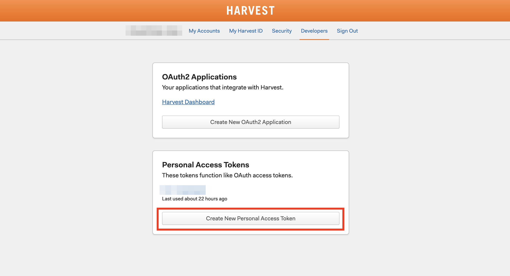
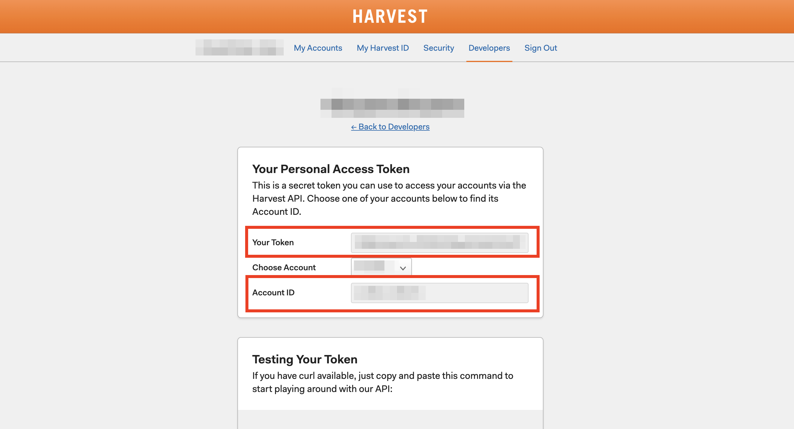

# Harvest Dashboard


[](https://github.com/vincentrohde/harvest-dashboard/actions/workflows/deploy.yml)
[](https://github.com/vincentrohde/harvest-dashboard/actions/workflows/codeql-analysis.yml)

[](https://github.com/vincentrohde/harvest-dashboard)
[](https://github.com/vincentrohde/harvest-dashboard)

A third-party React.js client for the [Harvest API V2](https://help.getharvest.com/api-v2/), that helps you to manage the time-trackings of your Harvest Account, while also giving you 
statistical feedback on how you spend your time.

## Contents

1. <a href="#getting-started">Getting Started</a>
    1. <a href="#prerequisites">Prerequisites</a>
    2. <a href="#installation">Installation</a>
    3. <a href="#access-to-harvest">Access to Harvest</a>
    4. <a href="#start-the-project">Start the Project</a>
2. <a href="#features">Features</a>
3. <a href="#development">Development</a>

## Getting Started

### Prerequisites

First of all, you will need a [Harvest account](https://www.getharvest.com) to fully use this project. The [free version](https://www.getharvest.com/pricing) will do fine. To run the client, 
you need to have **Node.js** and its package manager **npm** installed on your environment.

### Installation

#### Clone repository

```
git clone https://github.com/vincentrohde/harvest-dashboard.git
cd ./harvest-dashboard
```

#### Install Server dependencies

```
cd ./server
npm install
```

#### Install Client dependencies

```
cd ./client
npm install
```

### Access to Harvest

#### Add an .env file

Start by creating your own `.env` file in the `/server` directory. You can use the `.env.example` file and just create a copy of it, with the filename `.env` like so:

````
cp ./server/.env.example ./server/.env
````

#### Harvest v2 Personal Access Token

If you have your [Harvest account](https://www.getharvest.com) ready. It's time to setup your own Personal Access Token. To do so, jump over to the [Developers section](https://id.getharvest.com/developers) of your account.

Under the tab **Personal Access Tokens** you will find the option **Create New Personal Access Token**



First of all start by setting the name for your token.


#### Setup Access to your Harvest Account

Now that you have your Personal Access Token. It's time to add its data to your `.env` file in `./server`. The fields marked in red (see below) are required in your `.env` file.



This should be your version of `./server/.env` :

```
HARVEST_API_URL=https://api.harvestapp.com
ACCESS_TOKEN={{ Insert "Your Token" here }}
ACCOUNT_ID={{ Insert "Account ID" here }}
READ_ONLY=false
```

### Start the Project

Now that you have everything in place you can start the servers.

#### Backend

To start the backend server, simply go to the `./server` directory and run the following command:

```
npm run start
```

The backend will be available under:

```
http://localhost:8080
```

#### Client

To start the client's dev-server, go to the `./client` directory and run:

```
npm run start
```

The dev-server will be available under:

```
http://localhost:3000
```

Now both servers are running and will automatically reload on file changes.

## Features

## Development

### Branches

#### master
The `master` branch is used as the project's release branch. No development should happen here, since every `push` (newest commit) to `master` will generate a new `minor version release` of the project, which will also end up starting a new `deployment` workflow.

#### develop
The `develop` branch is used as a collection for changes that will end up as a new release. In general, new pushes should only come through merging `feature/` or `bug/` branches into `develop`. Each push results in a `patch` version bump, that is handled as a `pre-release`. For smaller issues it's fine to commit directly into `develop`.

#### feature/

A `feature/**` branch should be used for the development of a new feature. When the feature is ready, a `Pull Request` into `develop` should be opened.

#### bug/

A `bug/**` branch should be used when fixing bug-issues. When the bug is fixed, a `Pull Request` into `develop` should be opened.

### Workflows

<a href="#harvest-dashboard">Back To Top</a>
